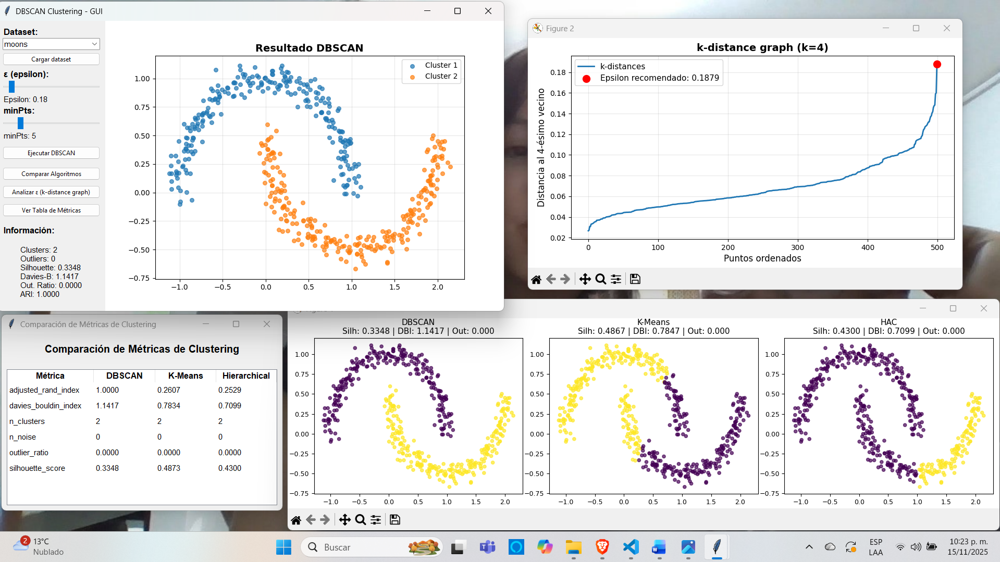

# Implementación del algoritmo DBSCAN (Density-Based Spatial Clustering of Applications with Noise)

## Características

- **Implementación propia** de DBSCAN en `core/my_dbscan.py`
- **GUI interactiva** con tkinter en `gui/main_gui.py`
- **Métricas de evaluación**: Silhouette Score, Davies-Bouldin Index, Adjusted Rand Index
- **K-distance graph** para selección empírica de epsilon
- **Comparación** con K-Means y Hierarchical Clustering

## Instalación

### Requisitos del Sistema
- Python 3.8 o superior
- pip (gestor de paquetes)
- 2 GB RAM mínimo (para datasets de 500 puntos)

### Instalación de Dependencias
```bash
# Clonar repositorio (si aplica)
git clone https://github.com/Ronaldmolinares/DBSCAN.git
cd DBSCAN

# Instalar dependencias
pip install -r requirements.txt
```

**Dependencias instaladas:**
- `numpy>=1.19.0`: Operaciones vectoriales y álgebra lineal
- `matplotlib>=3.3.0`: Visualización de gráficos
- `scikit-learn>=0.24.0`: Métricas y algoritmos de comparación
- `tk`: Interfaz gráfica (incluido con Python en Windows)

### Verificación de Instalación
```bash
python -c "import numpy, matplotlib, sklearn; print('Dependencias OK')"
```

## Uso

### 1. Interfaz Gráfica (Recomendado)
```bash
python run.py
```
Inicia la GUI interactiva con todas las funcionalidades.

### 2. Uso Programático
```python
from core.my_dbscan import MyDBSCAN
from core.datasets import load_moons
from core.metrics import compute_all_metrics

# Cargar datos
X, y_true = load_moons(n_samples=500, noise=0.07)

# Crear modelo
dbscan = MyDBSCAN(eps=0.3, min_pts=5)

# Ejecutar clustering
labels = dbscan.fit_predict(X)

# Evaluar
metrics = compute_all_metrics(X, labels, y_true)
print(f"Clusters encontrados: {metrics['n_clusters']}")
print(f"Silhouette Score: {metrics['silhouette_score']:.4f}")
print(f"Outliers: {metrics['n_noise']}")
```

### 3. Análisis desde Terminal
```bash
# Comparación de algoritmos
python -m experiments.comparison

# Análisis de epsilon
python -m experiments.sensitivity
```

### 4. Ejecución del proyecto


## Implementación DBSCAN

### Algoritmo Core

**Archivo**: `core/my_dbscan.py`

#### 1. Region Query
```python
def _region_query(self, X, idx):
    """Encuentra todos los puntos dentro del radio epsilon"""
    distances = np.linalg.norm(X - X[idx], axis=1)
    return np.where(distances <= self.eps)[0]
```

#### 2. Expand Cluster
```python
def _expand_cluster(self, X, labels, idx, neighbors, cluster_id):
    """Expande cluster siguiendo densidad alcanzable"""
    labels[idx] = cluster_id
    i = 0
    while i < len(neighbors):
        neighbor_idx = neighbors[i]
        if labels[neighbor_idx] == -1:  # Era ruido
            labels[neighbor_idx] = cluster_id
        elif labels[neighbor_idx] == 0:  # No visitado
            labels[neighbor_idx] = cluster_id
            new_neighbors = self._region_query(X, neighbor_idx)
            if len(new_neighbors) >= self.min_pts:
                neighbors = np.concatenate([neighbors, new_neighbors])
        i += 1
```

#### 3. Fit
```python
def fit(self, X):
    """Ejecuta DBSCAN y almacena resultados en self.labels_"""
    if X.shape[0] == 0:
        raise ValueError("Dataset vacío")
    if X.ndim != 2:
        raise ValueError("X debe ser matriz 2D")
    
    n = X.shape[0]
    labels = np.zeros(n, dtype=int)  # 0 = no visitado
    cluster_id = 0
    
    for point_idx in range(n):
        if labels[point_idx] != 0:
            continue
            
        neighbors = self._region_query(X, point_idx)
        
        if len(neighbors) < self.min_pts:
            labels[point_idx] = -1  # Ruido
        else:
            cluster_id += 1
            self._expand_cluster(X, labels, point_idx, neighbors, cluster_id)
    
    self.labels_ = labels
    return self

def fit_predict(self, X):
    """Ejecuta fit() y retorna las etiquetas"""
    self.fit(X)
    return self.labels_
```

**Entrada**: 
- `X`: numpy.ndarray de shape (n_samples, n_features)

**Salida**: 
- `labels_`: numpy.ndarray de shape (n_samples,) con valores:
  - `-1`: ruido/outliers
  - `0`: no procesado (solo durante ejecución)
  - `1, 2, ..., k`: ID del cluster asignado

### Clasificación de Puntos

- **Core Point**: Tiene ≥ `min_pts` vecinos dentro de `eps`
- **Border Point**: Está en vecindad de core point pero no es core
- **Noise**: No es core ni border (etiqueta = -1 ~ruido)

## Métricas Implementadas

### 1. Silhouette Score
Mide qué tan bien cada punto se ajusta a su cluster vs otros clusters.
- Rango: [-1, 1]
- Mejor: valores cercanos a 1

### 2. Davies-Bouldin Index
Relación entre dispersión intra-cluster y distancia inter-cluster.
- Rango: [0, ∞)
- Mejor: valores cercanos a 0

### 3. Adjusted Rand Index
Similaridad con etiquetas verdaderas (corregido por azar).
- Rango: [-1, 1]
- Mejor: valores cercanos a 1

### 4. K-Distance Graph
Gráfico para seleccionar epsilon óptimo:
- Muestra la distancia al k-ésimo vecino más cercano
- Se usa k = minPts - 1 (excluyendo el punto mismo)
- El "codo" en la curva sugiere un valor apropiado de epsilon


## Estructura del Proyecto

```
DBSCAN/
├── core/
│   ├── my_dbscan.py        # Implementación DBSCAN desde cero
│   ├── metrics.py          # Métricas de evaluación y k-distance
│   └── datasets.py         # Generación y carga de datos
├── gui/
│   └── main_gui.py         # Interfaz gráfica completa
├── experiments/
│   ├── comparison.py       # Comparación DBSCAN vs K-Means vs HAC
│   └── sensitivity.py      # Análisis de sensibilidad de epsilon
├── images/
│   └── dbscan_result.png   # Captura de resultados
├── requirements.txt        # Dependencias del proyecto
└── run.py                  # Punto de entrada principal
```

## Funcionalidades GUI

### Panel de Control
1. **Selección de Dataset**: 
   - Datasets sintéticos: moons, circles, blobs (con ground truth)
   - Carga de archivos CSV personalizados
   
2. **Ajuste Interactivo de Parámetros**:
   - Slider de **Epsilon (ε)**: 0.05 - 2.0 con actualización en tiempo real
   - Slider de **minPts**: 2 - 20 con actualización en tiempo real

### Funciones de Análisis
3. **Ejecutar DBSCAN**: 
   - Clustering con parámetros actuales
   - Visualización de resultados
   - Métricas en panel informativo

4. **Comparación de Algoritmos**: 
   - Visualización lado a lado: DBSCAN vs K-Means vs Hierarchical
   - Gráficos comparativos con métricas superpuestas

5. **Analizar ε (k-distance graph)**: 
   - Gráfico de k-distancias ordenadas
   - Detección automática del "codo"
   - Recomendación de epsilon óptimo

6. **Ver Tabla de Métricas**: 
   - Tabla comparativa emergente
   - Métricas de los 3 algoritmos en formato tabular


## Datasets Soportados

### Datasets Sintéticos (con ground truth)
- **moons**: Dos medias lunas entrelazadas (n_samples=500, noise=0.07)
- **circles**: Círculos concéntricos (n_samples=500, noise=0.07, factor=0.5)
- **blobs**: Clusters gaussianos (n_samples=500, centers=3)

### Archivos CSV Personalizados
**Formato requerido:**
```csv
x1,x2
1.5,2.3
2.1,3.4
...
```

**Especificaciones:**
- Separador: coma (`,`)
- Mínimo 2 columnas (coordenadas)
- Solo valores numéricos
- Filas con NaN se filtran automáticamente
- Normalización opcional disponible

## Ventajas de DBSCAN

- Detecta clusters de **forma arbitraria** (no convexos)
- No requiere especificar número de clusters a priori
- Identifica **outliers** explícitamente (label=-1)
- Robusto a ruido en los datos
- Basado en densidad local (no en distancia global como K-Means)

## Experimentos y Scripts de Análisis

### 1. Comparación de Algoritmos
```bash
python -m experiments.comparison
```
Ejecuta benchmark comparativo entre DBSCAN, K-Means y Hierarchical Clustering en dataset 'moons'. Genera visualizaciones lado a lado y tabla de métricas en consola.

### 2. Análisis de Sensibilidad de Epsilon
```bash
python -m experiments.sensitivity
```
Genera k-distance graphs para múltiples valores de minPts. Útil para:
- Determinar epsilon óptimo empíricamente
- Analizar sensibilidad del parámetro
- Comparar comportamiento con diferentes k

**Salida**: Gráficos de k-distances con epsilon recomendado marcado.

## Parámetros del Algoritmo

| Parámetro | Descripción | Rango GUI | Rango típico |
|-----------|-------------|-----------|--------------|
| `eps` (ε) | Radio de vecindad para considerar vecinos cercanos | 0.05 - 2.0 | 0.1 - 1.0 |
| `min_pts` | Número mínimo de puntos en ε-vecindario para ser core point | 2 - 20 | 3 - 10 |

### Selección de Parámetros

**Epsilon (ε):**
- **Método recomendado**: Usar k-distance graph con k = minPts - 1
- **Regla empírica**: El "codo" en la curva sugiere epsilon apropiado
- **Advertencia**: El epsilon recomendado puede producir 1 solo cluster si es muy grande. Ajustar manualmente según visualización.

**minPts:**
- **Dimensión baja (2D)**: minPts ≥ 3 (mínimo recomendado)
- **Regla general**: minPts ≥ dimensión + 1
- **Datasets con ruido**: Valores más altos (5-10) para mayor robustez

## Dependencias

- **Python 3.8+**: Lenguaje base
- **NumPy**: Operaciones matriciales y cálculo vectorizado
- **Matplotlib**: Visualización científica
- **scikit-learn**: Solo para métricas de evaluación y algoritmos de comparación
- **tkinter**: Framework nativo de GUI (incluido con Python)

**Nota sobre sklearn**: La implementación de DBSCAN es completamente independiente. Se usa sklearn únicamente para:
- Métricas (Silhouette Score, Davies-Bouldin, ARI)
- Algoritmos de comparación (K-Means, Hierarchical)
- Generación de datasets sintéticos

## Autores

Molinares Sanabria Ronald Samir  
Peña Coronado Esteban Nicolas  
Sanchez Munevar Diego Armando  
Torres Fonseca Laura Katalina  

Proyecto desarrollado para el curso de Inteligencia Computacional.
